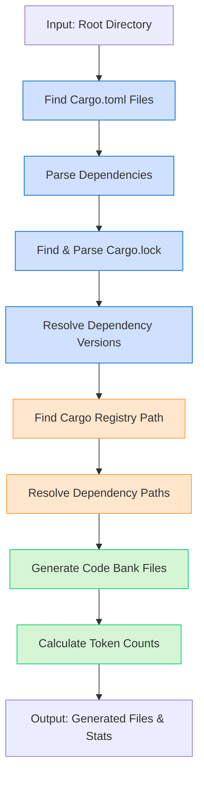

# System Patterns

## Architecture

The DepBank system follows a sequential processing pipeline:

## Data Structures

- **Dependencies Hashset**: Stores dependency names from Cargo.toml
- **Version Hashmap**: Maps dependency names to their versions from Cargo.lock
- **Path Hashmap**: Maps dependency names to their full filesystem paths

## Key Algorithms

1. **Recursive File Finding**: To locate all Cargo.toml files
2. **Registry Path Resolution**: Find latest registry by modification date
3. **Dependency Path Construction**: Combine registry path with dependency info
4. **Code Bank Generation**: Use codebank library with summary strategy

## File Organization

- **Input**: Cargo.toml and Cargo.lock
- **External Resources**: Cargo registry (~/.cargo/registry/src)
- **Output**: Generated code bank files (./.codebank/{dep_name}.md)

## Error Handling

Use anyhow for error propagation with descriptive messages:
- Missing Cargo.toml/Cargo.lock files
- Registry not found
- Dependency source code not available
- Code bank generation failures
